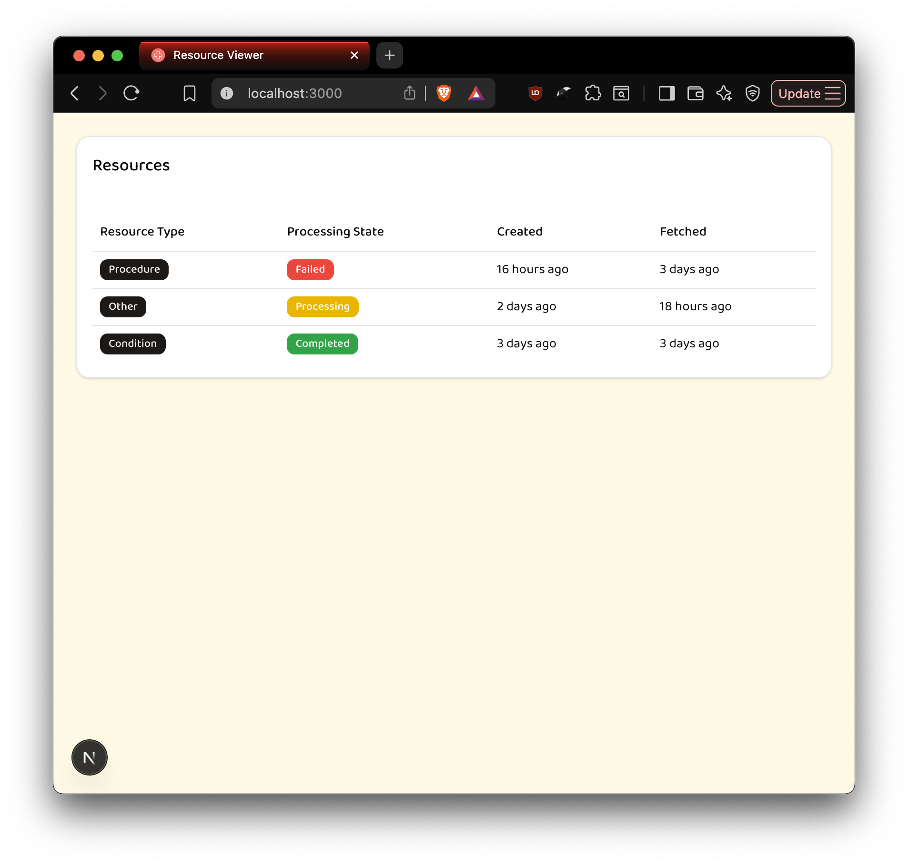
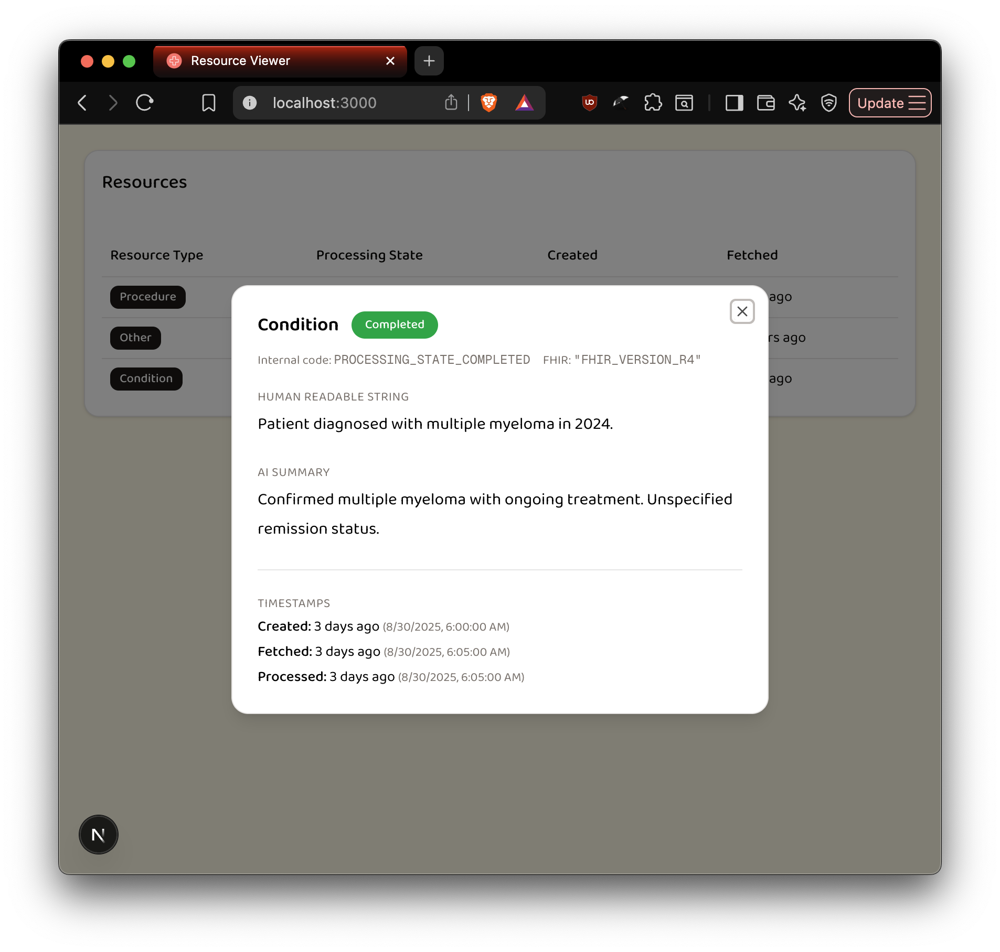
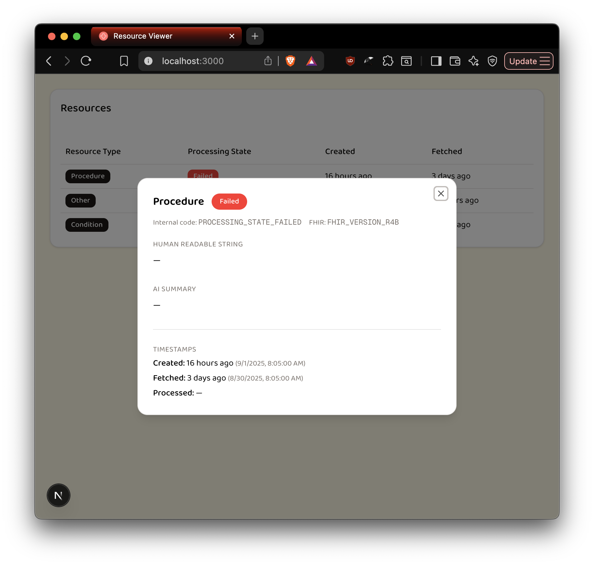
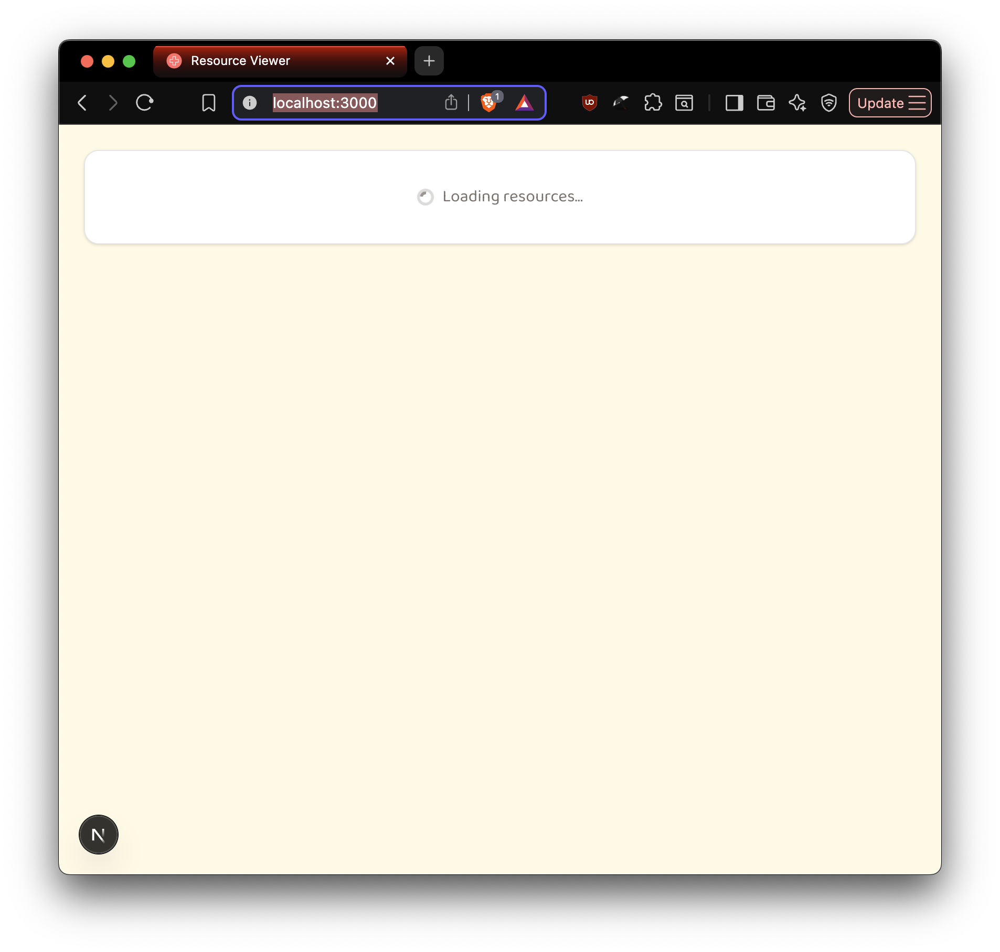

# Resource Viewer


A small **Next.js + shadcn** app that displays **FHIR resource wrappers** from Firestore in a table with detail popups.  

The table shows:  
- **Resource Type**  
- **Processing State** (color coded for easy readability)  
- **Created Time** (relative to now, eg. 16 hours ago)  
- **Fetched Time** (relative to now, eg. 1 day ago)  

Clicking a row opens a detail dialog with:  
- Human Readable String  
- AI Summary  
- Internal Processing Code  
- FHIR Version  
- Timestamps (Created, Fetched, Processed)

## 📸  Screenshots

<table>
  <tr>
    <td align="center">
      
      <br><sub>Main view</sub>
    </td>
    <td align="center">
      
      <br><sub>User Detail</sub>
    </td>
  </tr>
</table>

<table>
  <tr>
	<td align="center">
      
      <br><sub>Search</sub>
    </td>
    <td align="center">
      
      <br><sub>On the Home Screen</sub>
    </td>
  </tr>
</table>

<br><br>

## 🚀 How to Run

1. Clone the repo:
   
```
   bash
   git clone [this repo]
   cd resource-viewer
```

2.	Install dependencies:

    npm install


3.	Copy .env.local.example to .env.local and fill in your Firebase credentials

5.	Start the dev server:

    npm run dev

6.	Open http://localhost:3000 in your browser.

7.  Set up Firestore

    (See 🔧 Firestore Setup below)

<br>

## 🔥 Firestore Setup


1.	Create a Firebase project and enable Cloud Firestore.

2.	Add a .env.local file in the project root with your Firebase/Firestore config <br />

3.	Create a collection called resourceWrappers.

  	Each document should contain the following fields (from the pastebin schema):
  	```
  		resource: map
            •	humanReadableStr: string
            •	aiSummary: string

		metadata: map
            •	createdTime: string
            •	fetchTime: string
            •	processedTime: string
            •	resourceType: string (e.g. "Condition", "Procedure")
            •	state: string (PROCESSING_STATE_COMPLETED, PROCESSING_STATE_FAILED, etc.)
            •	version: string (FHIR version, e.g. "FHIR_VERSION_R4")
		
        identifier: map
            •	key: string
            •	patientId: string
            •	uid: string


## 📂  Folder Structure
	src/
	 app/                # Next.js app router
	  -globals.css       # Global styles
	  -layout.tsx        # Root layout
	  -page.tsx          # Entry page
	 components/
	  -resource-table/   # ResourceTable & columns
	  -ui/               # shadcn/ui elements (badge, button, card, dialog, table)
	  -lib/              # Firebase + utilities (time helper and utils)
	  -types/            # Pastebin schema

## 🛠️ Notes
	•	Reads from Firestore collection resourceWrappers.
	•	I added a few example documents to demonstrate multiple states (Completed, Processing, Failed, etc).
	•	Uses shadcn/ui tables, badges and dialogs for a clean, accessible UI.
	•	In the detail view (when a row is clicked), timestamps are displayed both in relative (e.g. “3 days ago”) and absolute formats.
